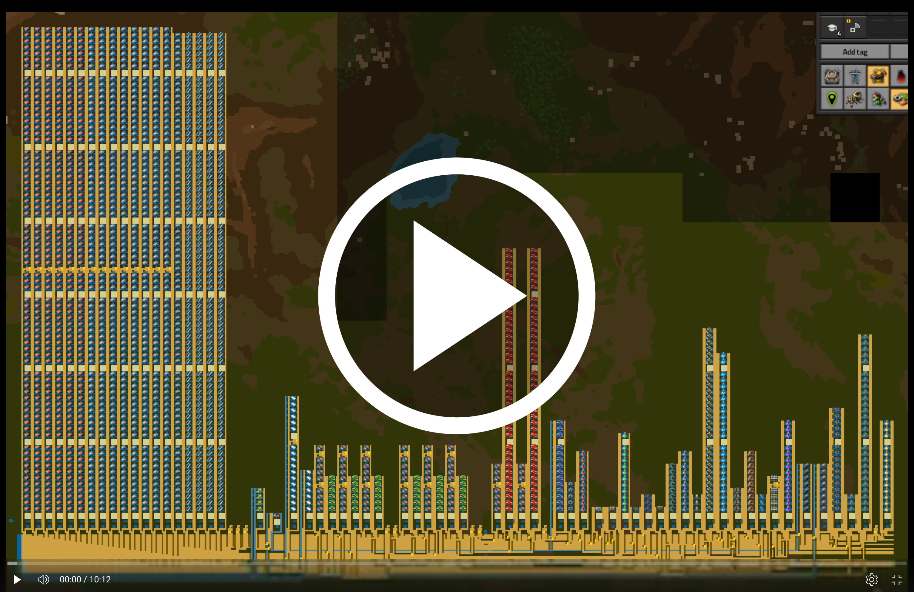

# Functorio

Functorio lets you build your Factorio factories in the Lean programming language; giving you conveniences like type safety, functions, recursion, version history, libraries, etc. 

For example, here's a simple factory that generates 150 red science per minute.

```lean
def redScience := bus do
  let ironOre <- input .ironOre 300
  let copperOre <- input .copperOre 150

  let iron : Iron 300 <- makeIron ironOre
  let copper : Copper 150 <- makeCopper copperOre
  let gear : Gear 150 <- makeGear iron
  let science : RedScience 150 <- makeRedScience copper gear
```

Functorio let's you export your factories as blueprints, ready to be imported into Factorio:


In addition to making it easy to write factories, Functiorio also makes it safe! Every resource that is passed around (like `iron`, `gear`, `science`, ...) has a type indicating the kind of item and the number of items provided per minute. In addition, every factory (like `makeIron`, `makeGear`, `makeRedScience`, ...) indicates how many resources it takes and returns. Thus, when your factory type checks, it often just works. And here are the stats to prove it:


[Here](Nauvis150.lean)'s a factory that is a bit more complicated, producing 150 science per minute for all the sciences on Nauvis, and here's a video walkthrough of the factory:

[](https://youtu.be/HK3KwjN-Dtc)

To get started download the [github repo](https://github.com/konne88/factorio2) and open it in
VSCode. The github repo contains a devcontainer so VSCode will automatically install all necessary dependencies and you can just run:

```bash
./red-science-150.sh > blueprint.txt
```

This will print a blueprint that you can import directly into Factorio.

This library is still in early alpha. Let's make it better together! Join the [discord](https://discord.gg/UGEcqxpSMn), send me
pull requests, file github issues, email me, etc. Anything you think is interesting is probably also interesting to me.

I'm not the first person to have looked into the connection between Factorio and programming languages. Bartosz Milewski gave a [talk](https://www.youtube.com/watch?v=A46KQtriYuM) and wrote a great [blog post](https://bartoszmilewski.com/2021/02/16/functorio/) about the connection; and also came up with the name Functorio in his post.

The following sections describe Functorio's features in more detail. At the end of this post you'll see how to build 
a factory that generates 150 of all the Nauvis sciences (red, green, blue, yellow, purple, black) per minute.

# Buses

A `bus` lets you connect multiple factories in a conventient a safe way. Here is an example bus that makes gears from iron ore. You just specify how the resources should flow,
and the `bus` function creates the required bus entities (belts, pipes, etc) to realize that intention. The way factories get connected resembles the [main bus](https://wiki.factorio.com/tutorial:main_bus) pattern, hence the name.

Here's a simple gear bus example: 

```lean
def gearFactory := bus do
  let ironOre : IronOre 300 <- input .ironOre 300
  let iron : Iron 300 <- makeIron ironOre
  let gear <- makeGear iron
```


The variables on a bus (e.g. `ironOre`, `iron`, `gear`) represent the lanes of the bus, and have the type `BusLane ingredient throughput`. 
For example `ironOre` has the type `BusLane .ironOre 100` which means this lane carries 100 iron ore per minute. The library also 
provides shorter name for the types, e.g. `IronOre 100` is a synonym for `BusLane .ironOre 100`.
A bus lane can be consumed by passing it into a factory, e.g. `makeIron ironOre`. 
New lanes can be returned by factories, for example the `makeGear` factory creates the new `gear` lane.

The `input` command creates a new bus lane that is expected to be filled outside the factory. This is useful to provide the raw 
ingredients for your factory. All inputs must be declared at the beginning of the bus, before any factories are used.

Bus lanes must only ever be consumed once. It is invalid to pass the same lane into two factories. If this is desired, the lane 
must first be split into two lanes, using the `split (left:=x) (right:=y)` function. Here is an example:

```lean
def splitIron := bus do
  let iron : Iron 450 <- input .ironPlate 450
  let (iron0, iron1) <- split (left:=300) (right:=150) iron
  let gear <- makeGear iron0
  let belt <- makeBelt iron1 gear
```


Similarly, lanes can be merged with the `merge` function. Here is an example:

```lean
def mergeSteel := bus do
  let iron0 <- input .ironPlate 2700
  let iron1 <- input .ironPlate 2700
  let steel0 <- makeSteel iron0
  let steel1 <- makeSteel iron1
  let steel <- merge steel0 steel1
```


The bus also supports liquids. Those are used just like solid ingredients, but the bus will generate
pipes instead of belts to connect them. e.g.

```lean
def acidFactory := bus do
  let iron <- input .ironPlate 60
  let sulfur <- input .sulfur 300
  let water <- input .water 6000
  let acid <- makeAcid water iron sulfur
```


# Bus Taps

We've talked about passing resources around the bus, but we still haven't talked about how `makeBelt` etc is actually implemented.
To connect a factory to the bus, you need to create a `busTap`, which takes a list of input belt lanes from the bus, connects to the given `factory` and returns the output of the factory. For example, `makeBelt` can be implemented as follows

```lean
def makeBelt iron gear :=
   busTap [iron, gear] factory
```

# Factories

A `Factory` is a collection of entities (assemblers, belts, inserters, etc) placed within a rectangle, 
and has interfaces on all sides of that rectangle (north, east, south and west). 
For the below example, the north and south interface are the same: two belts, one iron belt facing north and one gear belt facing south.
The east and west interfaces are empty. 


The type of a factory is `Factory n e s w` where the letters stand for the north, east, south, and
west interfaces. Each interface specifies the resource type and travel direction of that resource.
Thus the above factory's type is:

```lean
gearFactory : Factory 
  [(.iron, .N), (.ironGearWheel, .S)]  -- north interfaces
  []                                   -- east interfaces
  [(.iron, .N), (.ironGearWheel, .S)]  -- south interfaces
  []                                   -- west interfaces
```

The `Factory` type is designed so that you should only have to worry about a factory's interfaces,
but not its size, entities, or the position of the interfaces. The interfaces are reflected in
the `Factory`'s type, so when your factory type checks, it should ideally just work.

# Columns / Rows

Two factories with matching north/south interfaces can be combined with the `column` command. Here's an example:

```lean
column gearFactory gearFactory
```


There is also a `columnList` command, which connects all the factories from the given list. 
To create a column of 10 gear factories, you would write:

```lean
columnList (List.replicate 10 gearFactory)
```

Similarly, there is also a `row`/`rowList` command, which combines factories with matching east/west interfaces.

# Expanding

Sometimes the factories that you want to combine don't have the same dimensions. Expanding a
factory increases the factory's width/height without changing its interfaces.
For example, here we're expanding a factory's south by 5 tiles:

```lean
expand .S 5 inserterFactory
```

Expansions are automatically generated when you combine factories with `column`/`row`, so you
generally don't have to worry about the dimensions of factories.


# Adapters

Sometimes the factories that you want to combine have the sames interfaces,
but the belts/pipes are in different positions. That's where adapters come in. For example, here we're trying
to connect some inserter assemblers to a bus.


Adapters are automatically generated when you combine factories with `column`/`row`, so
you generally don't have to worry about the position of interfaces (but the order of interfaces matters).

# Caps

Sometimes you want to remove an interface from a factory. The `capN`, `capE`, `capS`, `capW` commands do just that.

```lean
capS inserterFactory
```


# Assembly Lines

Functorio comes with a builtin set of factories to assemble all the recipes required for red, green, blue, purple, yellow, and black science (contributions for more recipes are very welcome!). 
These factories are designed so that they can be replicated many times into an assembly line.

To get just a single assembler for a certain recipe, you can use the `station` function (because it's one station of a larger assembly line):

```lean
station .ironGearWheel
```


If you want to have multiple stations connected, you can call:

```lean
assemblyLine .ironGearWheel 3
```


Calling `assemblyLine` is similar to just replicating the station multiple times, but the `assemblyLine` command 
will also automatically insert output load balancers, roboports, passive provider chests, and big electric poles if desired.

To get a factory that can be attached to a bus, call:

```lean
busAssemblyLine .ironGearWheel 3
```

Checkout the file `NauvisScience150.lean` for a full factory that uses the assembly line library for all its needs.
You can generate a blueprint as follows:

```bash
./nauvis-150.sh > blueprint.txt
```

Which looks like this:


And as promised, produces 150 of all the Nauvis sciences per minutes.


# Configuration

You can configure how Functorio generates certain aspects of your factory, by providing a `Config` instance.

```lean
instance : Config where
  generateRoboports := true   -- assembly lines add roboports
  generateBigPoles := true    -- assembly lines add big poles
  providerChestCapacity := 5  -- assembly lines add provider chests for outputs
  adapterMinHeight := 3       -- minimum height of adapters
```

# Debugging

Sometimes you can't convince Lean that two factories have the same interface, even though you know that they do.
You can use the `factory.unsafeCastFactory` to change the interface of your factory to whatever you want.

Lean isn't all that great a printing types. For example, Lean will print the type of
`busAssemblyLine .processingUnit 14` as `BusAssemblyLineType (getRecipe .processingUnit) 14`.
This is really quite useless. If you want to know what that type expands to, you can run 
the following code, and see the simplified type in Lean's InfoView.

```lean
def x : BusAssemblyLineType RecipeName.processingUnit 14 := by
  simp!
```

Which is:

```lean
BusLane Ingredient.sulfuricAcid (525, 1) →
BusLane Ingredient.electronicCircuit (2100, 1) →
BusLane Ingredient.advancedCircuit (210, 1) →
Bus (BusLane Ingredient.processingUnit (105, 1))
```

# Future Work

This library is still in early alpha. Let's make it better together! Expect bugs!
For any problems, please reach out on [discord](https://discord.gg/UGEcqxpSMn), file a ticket on github or contact me via email.
If you have a Lean problem, there are many really helpful people in this [chat](https://leanprover.zulipchat.com/).

There are still a lot of things that need modeling: e.g. other kinds of belts and inserters, 
modules, beaconized factories, quality, rails, etc. I'm happy to take contributions!
